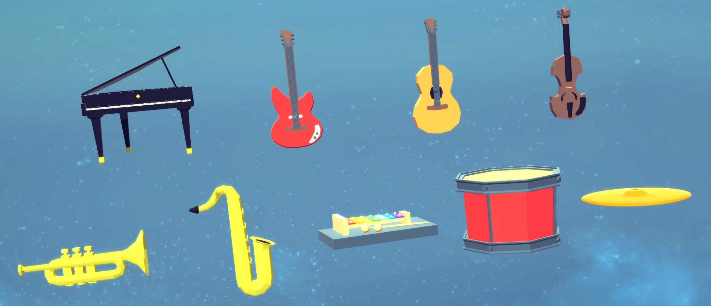

# Besiege Orchestra

Nine instrument blocks, and a tenth that turns a MIDI file into a machine that
plays them, in [Besiege](https://store.steampowered.com/app/346010/Besiege/).



Piano, guitar, bass, strings, brass, woodwind, mallets, drums and cymbals. Each
block plays one note on one key, heard from where the block stands — so a machine
can carry a band, and you hear it move.

The **MIDI loader** block — the download arrow — reads a score off your disk and
writes the machine that plays it, either straight into what you are building or
out to a saved machine of its own.

**[UI Factory](https://steamcommunity.com/sharedfiles/filedetails/?id=2913469777)**
(another Besiege mod which enables the nice UI, see workshop item `2913469777`) is
optional here. With it the blocks get a panel docked under the block mapper;
without it they use Besiege's ordinary mapper and everything still works.

## Install

Either subscribe to the mod on Steam, or if you don't use Steam you can clone the repo then:

```sh
./tools/install.sh              # symlink into Besiege_Data/Mods
./tools/install.sh --copy       # copy instead
./tools/install.sh --uninstall
```

Set `BESIEGE_DIR` if your install isn't found automatically. Start Besiege, enable
**Orchestra** in the mods menu, and the nine blocks appear in the toolbar. No C#
toolchain is needed; the build uses Besiege's own compiler.

## Options

Every block has these:

| Setting | What it does |
| --- | --- |
| Play | Key that sounds the note. Default `N` |
| Instrument | Which instrument of that family |
| Note | Pitch, as a MIDI note number. 60 is middle C |
| Volume | 0 to 1 |
| Range | How far it carries before falling silent |
| Toggle | On, the key starts and stops. Off, it plays while held |

**Toggle** is only on strings, brass and woodwind. Latching the key means nothing
on something struck or plucked: those notes die on their own whatever the key
does.

Each block adds its own on top:

| Block | Adds |
| --- | --- |
| Piano | Sustain, Release |
| Guitar | Pluck, Palm mute |
| Bass | Slap |
| Strings | Pizzicato, Vibrato |
| Brass | Mute, Attack, Vibrato |
| Woodwind | Breath, Vibrato |
| Mallets | Hardness, Motor |
| Drums | Tune, Decay, Damping |
| Cymbals | Size, Open |

They mean what they say rather than switching to another recording. **Pizzicato**
drops the loop out of a bowed note and cuts its tail; **Mute** and **Palm mute**
are the same low-pass, because a hand on the strings and a mute in a bell come to
the same thing; **Size** on a cymbal lengthens the decay *and* crowds the
partials, because that is what a bigger plate does.

Sliders are clipped but out-of-range values can be typed.

| Setting | Slider | Typed |
| --- | --- | --- |
| Note | 21–108 (a piano's keys) | 0–127 |
| Range | 5–500 m | 0.5 m – 2 km |
| Attack | 0.005–1.5 s | up to 60 s |
| Decay | 0.05–3 s | up to 60 s |
| Release | 0.05–6 s | up to 60 s |

## The panel

With UI Factory installed, opening a block brings up a panel docked to the bottom
edge of the block mapper, the same width, following it as you drag it. The
instrument sits in the game's own `< Grand piano >` selector, the note is shown as
a note name and snaps to semitones, and there is a row for every control the block
declared — so a new instrument gets its panel for nothing.

The speaker at the bottom left plays the block where it stands, with the settings
as they are, so an instrument can be chosen by ear without starting the machine.
The block's toggles share the rest of that row.

The mapper above keeps the key and nothing else: two panels for one block is one
too many, and rebinding needs Besiege's own key capture. Without UI Factory the
mapper keeps everything, which is what makes it a fallback rather than a second
copy.

## Playing a song, from inside the game

Place the **Loader** block — the download arrow in the toolbar — and click it.
Besiege's menu above keeps **the key and nothing else**: every timer the block
writes waits for that key, so binding it there binds the whole song. Everything
else is in the panel docked underneath:

1. **INSTRUMENT** and **TYPE** are the block a score is written for and the
   instrument within it; changing the first refills the second. Percussion always
   goes to Drums and Cymbals whatever these say.
2. **VOLUME**, **RANGE**, **TRANSPOSE** and **DELAY** are what every block it
   writes is set to. Delay is the pause between the key and the first note — a
   machine dropped into a level is usually still falling for the first second.
3. **TEMPO** is the speed in beats per minute. It follows the file — picking a new
   one puts it back to whatever that file says — until you move it or type a
   number, and then that is what gets built. Left alone it keeps a score's own
   tempo changes; set by hand it plays the whole thing at one speed.
4. **FOLDER** is where MIDI files go:
   `Besiege_Data/Mods/Data/Orchestra_<id>/Songs`. It can be typed into, to point
   at another folder *inside the mod's data directory* — Besiege lets a mod read
   nowhere else, which is also why there is no "browse" dialog. The two buttons
   open it in your file manager and list it again, for a file dropped in while the
   game is running.
5. **FILE** lists what is in that folder — click it and pick one. Songs that ship
   with the mod are listed after your own with **(built-in)** in front of them, so
   a bundled `waltz.mid` and one of yours by the same name are both there and
   neither hides the other.
6. The summary says how long the song is, how many notes survived, and what it
   will cost in blocks — an instrument block per distinct voice, a timer per note
   — before you commit to any of it.
7. **ADD TO MACHINE** drops those blocks into the machine you are building,
   already selected, so you can drag them where you want them. **SAVE AS MACHINE**
   does the same and then opens Besiege's own save screen over it, where
   **SELECTION ONLY** saves just those blocks — the game names the file, asks
   before overwriting, and draws the thumbnail.

With no key bound the song starts with the simulation instead.

The loader needs UI Factory — Besiege's own menu has no text box, no list and no
button. Without it, the tool below does the same job outside the game.

## Playing a song, from the command line

`tools/make-song.py` turns a MIDI file into a machine that plays it, with more
control than the block has — several instruments at once, part of a score, a
tempo of your own:

```sh
./tools/make-song.py travelers.mid --instrument "Piano:Grand piano" --install
```

One instrument block per pitch, one timer block per note, joined by Besiege's
variable system and laid out in a grid on the ground. No dependencies — the MIDI
parser is in the tool. `--help` lists every block and the instruments it holds.

**Which block plays what.** `--instrument` is where every note goes unless a
`--track` says otherwise; both take a family, optionally with one of that family's
instruments after a colon. Each family, instrument and pitch gets its own block,
so several parts can play at once:

```sh
./tools/make-song.py song.mid --instrument "Strings:Ensemble" \
    --track 0="Piano:Grand piano" --track 2=Bass --track 3="Brass:Trumpet"
```

Channel 10 is General MIDI percussion whatever the tracks say, and goes to Drums
and Cymbals by kit piece. The score's own program changes are not read, so which
part plays what is `--track`'s to say — and a format 0 MIDI keeps every part on
one track, where `--track` cannot separate them.

| Option | What it does |
| --- | --- |
| `--instrument FAMILY[:TYPE]` | the block for every note (default `Piano`) |
| `--track N=FAMILY[:TYPE]` | the block for one track, repeatable |
| `--key KEYCODE` | start on a keypress rather than with the simulation |
| `--tempo BPM`, `--transpose N` | override the tempo; shift in semitones |
| `--from S`, `--seconds S` | play part of the score |
| `--offset S`, `--gap S` | quiet before the first note; silence between repeats |
| `--limit N` | most notes to place (default 1200) |
| `--columns N`, `--spacing N`, `--height N` | the grid, and where it spawns |
| `--volume N`, `--range N` | scales every block's volume; how far they carry |
| `--no-drums` | treat channel 10 as pitched rather than as a kit |
| `--install` | write into Besiege's `SavedMachines` as well |

MIDI rather than a YouTube link on purpose: a recording has to be transcribed
before anything can play it, which is a research problem and a 100 MB neural
network away, while a score already *is* the notes. MuseScore exports MIDI from
anything in its library. See [docs/SONGS.md](docs/SONGS.md) for the rest — the
percussion mapping, why repeated notes need a gap, and what to expect in game.

## One block, one note

A block plays a single note, and a tune is a row of blocks each triggered by its
own variable. That is not a shortcut — Besiege binds automation variables to keys
and to nothing else, so a note slider could never be driven by a variable.

Blocks are still polyphonic, eight voices each. That is not for chords, which come
from separate blocks, but so striking a block again does not cut off what is still
ringing.

A block swells when it plays, and goes on breathing while a held note lasts. It is
the visual that moves and not the block, so a machine does not turn springy
because it is playing.

## Sound

**Synthesised** — mallets, drums, cymbals. A bank of decaying partials for
anything metal: rigid metal rings at frequencies that are not harmonics, which is
why a crash starts bright and ends as a hum, and why **Size** and **Decay** here
change the physics rather than pick a different recording. Drums are a pitched
body that falls as it decays, plus noise for the skin.

**Sampled** — piano, guitar, bass, strings, brass, woodwind. Three recorded notes
per instrument, so pitch-shifting never stretches more than about three semitones.
The 84 clips are cut from [GeneralUser GS](https://github.com/mrbumpy409/GeneralUser-GS)
at build time and come to 776 KB; see [docs/SAMPLES.md](docs/SAMPLES.md) for how,
and how to cut them from a different font.

Sound is generated in `OnAudioFilterRead`, which the mixer calls on the buffer it
is about to play, so a note starts when the key does. The obvious alternative — a
streaming `AudioClip` fed through a PCM reader callback — is read well ahead of
being heard and answers the key late. So each block places itself instead: a gain
per ear, worked out each frame from where it stands relative to the listener.

## Adding an instrument

No code. Each block's XML declares its own types and controls:

```xml
<Type name="Vibraphone" engine="modal" decay="4.0" brightness="0.45"
      inharmonicity="1.18" noise="0.08" />
<Extra kind="slider" key="MotorKey" name="Motor" min="0" max="1" default="0" />
```

`engine` is `modal`, `drum` or `sampler`. A sampled type names its clips instead,
`samples="piano_grand_36 piano_grand_60 piano_grand_84"`, where the trailing
number is the MIDI note each was recorded at.

Each block wears its own instrument: low-poly models from
[Poly Pizza](https://poly.pizza), converted and stood upright by
`tools/make-block-meshes.py`. The loader block's download arrow is not a model at
all — `tools/make-arrow-mesh.py` builds it out of boxes, in the same conventions,
and can render it as the toolbar will see it. They carry no textures of their own, only a flat
colour per material, so the tool gathers those into a small palette and points
each triangle at its own patch — which is why a block's texture is a few dozen
bytes.

## Notes

Details land in `Player.log` and in the in-game console with `show_logs true`.

AI agent? see [AGENTS.md](AGENTS.md) for layout, build, and any relevant info.
[docs/MODDING-NOTES.md](docs/MODDING-NOTES.md) has what this mod had to work out
about Besiege's modding API — including how to dock a UI Factory window to the
block mapper, which is worth reading before trying it. The general notes, for a
mod that is not this one, are collected in
[Besiege-Modding-AI-notes](https://github.com/anton-scholten/Besiege-Modding-AI-notes).

## Credits

The block models are Creative Commons Attribution (CC-BY 3.0), from Poly Pizza:

| Block | Model | By |
| --- | --- | --- |
| Piano | [Piano](https://poly.pizza/m/7U-93vxPOER) | jeremy |
| Guitar | [Electric guitar](https://poly.pizza/m/0hg94uOO-sS) | jeremy |
| Bass | [Acoustic guitar](https://poly.pizza/m/afr6GCpce_I) | jeremy |
| Strings | [Violin](https://poly.pizza/m/fhj0GK-0kJu) | jeremy |
| Brass | [Trumpet](https://poly.pizza/m/0Mj5XgeGtKJ) | jeremy |
| Woodwind | [Saxophone](https://poly.pizza/m/6A2UAKdCNy7) | jeremy |
| Drums | [Drum](https://poly.pizza/m/5Wp2emwd7xw) | jeremy |
| Mallets | [Xylophone](https://poly.pizza/m/a-OYg3WVXfV) | Daniel Melchior |
| Cymbals | [Cymbal](https://poly.pizza/m/f8SdBE98BXE) | Poly by Google |

Sampled instruments are cut from [GeneralUser GS](https://github.com/mrbumpy409/GeneralUser-GS),
which is permissively licensed; only the cut samples are redistributed.

## Licence

MIT. Besiege is Spiderling Studios'; nothing of theirs is redistributed here.
Sampled instruments are cut from an open SoundFont — see
[docs/SAMPLES.md](docs/SAMPLES.md) for which, and under what terms.
