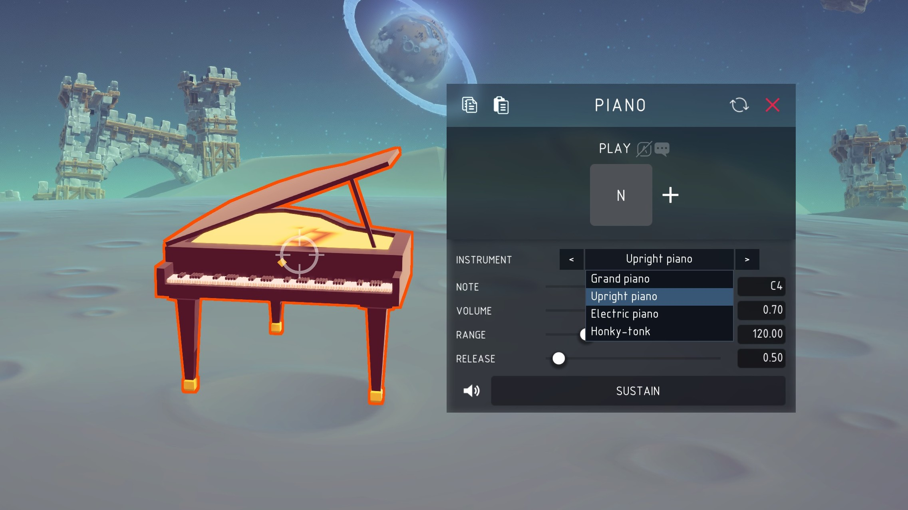
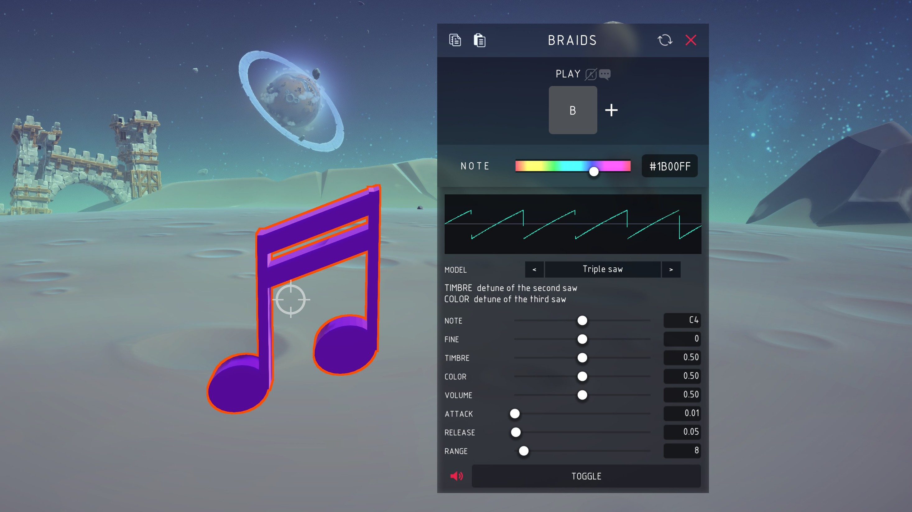
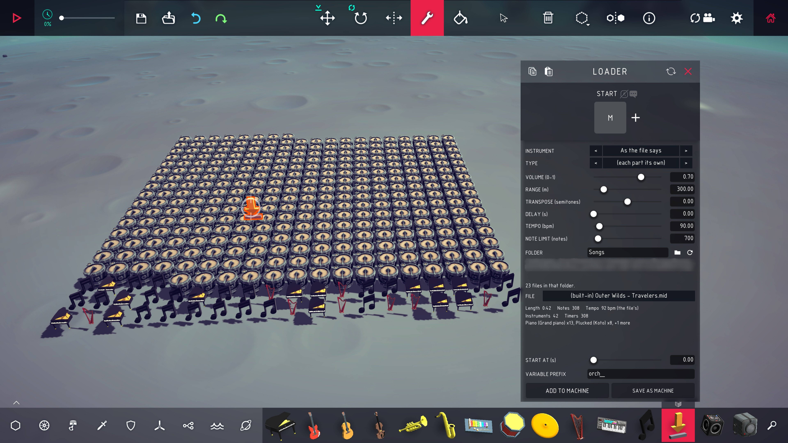

# Besiege Music


Twelve instrument blocks, and a thirteenth that turns a MIDI file into a machine that
plays them, in [Besiege](https://store.steampowered.com/app/346010/Besiege/).

Piano, guitar, bass, strings, brass, woodwind, plucked, mallets, drums, cymbals,
an FM synth and Braids. Each
block plays one note on one key, heard from where the block stands — so a machine
can carry a band, and you hear it move.

The **MIDI loader** block — the download arrow — reads a score off your disk and
writes the machine that plays it, either straight into what you are building or
out to a saved machine of its own.

**[UI Factory](https://steamcommunity.com/sharedfiles/filedetails/?id=2913469777)**
(another Besiege mod which enables the nice UI, see workshop item `2913469777`) is
optional here. With it the blocks get a panel docked under the block mapper;
without it they use Besiege's ordinary mapper and everything still works.

## Install

Either subscribe to the mod on Steam, or if you don't use Steam you can clone the repo then:

```sh
./tools/install.sh              # symlink into Besiege_Data/Mods
./tools/install.sh --copy       # copy instead
./tools/install.sh --uninstall
```

Set `BESIEGE_DIR` if your install isn't found automatically. Start Besiege, enable
**Music** in the mods menu, and the twelve blocks appear in the toolbar. No C#
toolchain is needed; the build uses Besiege's own compiler.

## Options

Every block has these:

| Setting | What it does |
| --- | --- |
| Play | Key that sounds the note. Default `N` |
| Instrument | Which instrument of that family |
| Note | Pitch, as a MIDI note number. 60 is middle C |
| Volume | 0 to 1 |
| Range | How far it carries before falling silent |
| Toggle | On, the key starts and stops. Off, it plays while held |

**Toggle** is only on strings, brass and woodwind. Latching the key means nothing
on something struck or plucked: those notes die on their own whatever the key
does.

Each block adds its own on top:

| Block | Adds |
| --- | --- |
| Piano | Sustain, Release |
| Guitar | Pluck, Palm mute |
| Bass | Slap |
| Strings | Pizzicato, Vibrato |
| Brass | Mute, Attack, Vibrato |
| Woodwind | Breath, Vibrato |
| Mallets | Hardness, Motor |
| Drums | Tune, Decay, Damping |
| Cymbals | Size, Open |

They mean what they say rather than switching to another recording. **Pizzicato**
drops the loop out of a bowed note and cuts its tail; **Mute** and **Palm mute**
are the same low-pass, because a hand on the strings and a mute in a bell come to
the same thing; **Size** on a cymbal lengthens the decay *and* crowds the
partials, because that is what a bigger plate does.

Sliders are clipped but out-of-range values can be typed.

| Setting | Slider | Typed |
| --- | --- | --- |
| Note | 21–108 (a piano's keys) | 0–127 |
| Range | 5–500 m | 0.5 m – 2 km |
| Attack | 0.005–1.5 s | up to 60 s |
| Decay | 0.05–3 s | up to 60 s |
| Release | 0.05–6 s | up to 60 s |

## The panel



With UI Factory installed, opening a block brings up a panel docked to the bottom
edge of the block mapper, the same width, following it as you drag it. The
instrument sits in the game's own `< Grand piano >` selector, the note is shown as
a note name and snaps to semitones, and there is a row for every control the block
declared — so a new instrument gets its panel for nothing.

The speaker at the bottom left plays the block where it stands, with the settings
as they are, so an instrument can be chosen by ear without starting the machine.
The block's toggles share the rest of that row.

The mapper above keeps the key and nothing else: two panels for one block is one
too many, and rebinding needs Besiege's own key capture. Without UI Factory the
mapper keeps everything, which is what makes it a fallback rather than a second
copy.

Every block is set the same way, the Braids synth included — the same rows, the
same selector, the same speaker and toggle at the foot. What it adds is its own:
a trace of the wave coming out, and a line for each of TIMBRE and COLOR saying
what they do under the model in force, because they do something different under
each of the twenty-three.



## Playing a song, from inside the game



Place the **Loader** block — the download arrow in the toolbar — and click it.
Besiege's menu above keeps **the key and nothing else**: every timer the block
writes waits for that key, so binding it there binds the whole song. Set that
mapping to a **variable** instead of a key and the timers wait for the variable, so
anything else on the machine can start the song — a trigger, a sensor, another
block's key. Leave it unbound and the song starts with the simulation. Everything
else is in the panel docked underneath:

1. **INSTRUMENT** and **TYPE** are the block a score is written for and the
   instrument within it; changing the first refills the second. Percussion always
   goes to Drums and Cymbals whatever these say. A new block starts on the last
   entry, **As the file says**, which gives each part the instrument the MIDI file
   declares for it — a violin
   part to Strings: Violin, a bass line to Bass — instead of one block for the
   whole song. It costs blocks: a part per instrument is a block per instrument per
   pitch, so the note limit covers less of the song.
2. **VOLUME**, **RANGE**, **TRANSPOSE** and **DELAY** are what every block it
   writes is set to. Delay is the pause between the key and the first note, nought
   by default — turn it up for a machine that is still falling into the level when
   its key goes.
3. **TEMPO** is the speed in beats per minute. It follows the file — picking a new
   one puts it back to whatever that file says — until you move it or type a
   number, and then that is what gets built. Left alone it keeps a score's own
   tempo changes; set by hand it plays the whole thing at one speed.
4. **NOTE LIMIT** is how many notes it will place, and so most of how many blocks
   the machine has — a timer apiece. 700 by default, up to 10000 typed into the
   box; the handle covers the first 5000. Let go of it and the summary says how
   many notes the new number leaves behind.
5. **FOLDER** is where MIDI files go:
   `Besiege_Data/Mods/Data/Music_<id>/Songs`. It can be typed into, to point
   at another folder *inside the mod's data directory* — Besiege lets a mod read
   nowhere else, which is also why there is no "browse" dialog. The two buttons
   open it in your file manager and list it again, for a file dropped in while the
   game is running.
6. **FILE** lists what is in that folder — click it and pick one. Songs that ship
   with the mod are listed after your own with **(built-in)** in front of them, so
   a bundled `waltz.mid` and one of yours by the same name are both there and
   neither hides the other.
7. **VARIABLE PREFIX** is what the song's variables are named after — `orch_000`,
   `orch_001` and so on. The blocks listen by name, so two songs sharing a machine
   need two names, or the second song's timers press the first song's blocks. A
   name that could not be one (a semicolon, a space) goes back to `orch_`.
8. The summary says how long the song is, how many notes survived, and what it
   will cost in blocks — an instrument block per distinct voice, a timer per note
   — before you commit to any of it.
9. **START AT** is where in the score to begin, in seconds. The note limit takes a
   long song from the front, so this is how the rest of it is reached: set it a
   minute in and the machine is built from there, with the key still playing the
   first note it holds. The handle covers the length of whichever song is loaded;
   the box takes anything past it.

Every slider says what its number is counted in — `RANGE (m)`, `TEMPO (bpm)`,
`TRANSPOSE (semitones)` — because none of them is a number you could tell the unit
of by looking at it.
9. **ADD TO MACHINE** drops those blocks into the machine you are building,
   already selected, so you can drag them where you want them. **SAVE AS MACHINE**
   does the same and then opens Besiege's own save screen over it, where
   **SELECTION ONLY** saves just those blocks — the game names the file, asks
   before overwriting, and draws the thumbnail.

With no key bound the song starts with the simulation instead.

The loader needs UI Factory — Besiege's own menu has no text box, no list and no
button. Without it, the tool below does the same job outside the game.

### Where to get MIDI files

All of these hand you a `.mid` with no account and no payment. Put it in the
folder the FOLDER row names and press the reload arrow.

- **[Online Sequencer](https://onlinesequencer.net/)** — a browser sequencer with a
  large library of user-made arrangements; *Export → MIDI* on any sequence.
- **[MIDI Toolbox](https://miditoolbox.com/)** — browse and download, and tools for
  trimming and transposing a file before it gets here.
- **[BitMidi](https://bitmidi.com/)** — around 113,000 files, the usual pop, film
  and game standards, one click each.
- **[MidiWorld](https://www.midiworld.com/)** — sorted by genre and by artist;
  small, old, tidy files.
- **[VGMusic](https://www.vgmusic.com/)** — video game music by console, which is
  written for a handful of monophonic voices and so converts to a small machine.
- **[Mutopia](https://www.mutopiaproject.org/)** and
  **[mfiles](https://www.mfiles.co.uk/)** — public-domain classical, engraved from
  the score rather than performed, so the timing is exact.

Two things to look at before building a thousand blocks for a file:

- **The tempo.** A MIDI file carries its own, and a badly exported one can carry
  something absurd — the nocturne bundled with this mod arrived claiming 999 bpm,
  which is a four-minute piece in thirteen seconds. The summary says what tempo the
  length was worked out at, and TEMPO overrides it.
- **The note count.** One timer per note. A dense orchestral arrangement is
  thousands of blocks, where a game theme written for four voices is a few hundred;
  the summary says which you have before anything is placed.

## Playing a song, from the command line

`tools/make-song.py` turns a MIDI file into a machine that plays it, with more
control than the block has — several instruments at once, part of a score, a
tempo of your own:

```sh
./tools/make-song.py travelers.mid --instrument "Piano:Grand piano" --install
```

One instrument block per pitch, one timer block per note, joined by Besiege's
variable system and laid out in a grid on the ground. No dependencies — the MIDI
parser is in the tool. `--help` lists every block and the instruments it holds.

**Which block plays what.** `--instrument` is where every note goes unless a
`--track` says otherwise; both take a family, optionally with one of that family's
instruments after a colon. Each family, instrument and pitch gets its own block,
so several parts can play at once:

```sh
./tools/make-song.py song.mid --instrument "Strings:Ensemble" \
    --track 0="Piano:Grand piano" --track 2=Bass --track 3="Brass:Trumpet"
```

Channel 10 is General MIDI percussion whatever the tracks say, and goes to Drums
and Cymbals by kit piece. The score's own program changes are not read, so which
part plays what is `--track`'s to say — and a format 0 MIDI keeps every part on
one track, where `--track` cannot separate them.

| Option | What it does |
| --- | --- |
| `--instrument FAMILY[:TYPE]` | the block for every note (default `Piano`) |
| `--track N=FAMILY[:TYPE]` | the block for one track, repeatable |
| `--key KEYCODE` | the key every timer waits for (default `M`; `--key none` starts with the simulation) |
| `--variable NAME` | wait for a variable instead of the keyboard, as the block does when its key is set to one |
| `--prefix NAME` | what the song's variables are named after (default `orch_`) |
| `--no-braids` | write the synth parts for the FM synth block rather than the Braids one |
| `--tempo BPM`, `--transpose N` | override the tempo; shift in semitones |
| `--from S`, `--seconds S` | play part of the score |
| `--offset S`, `--gap S` | quiet before the first note (default 0); silence between repeats |
| `--limit N` | most notes to place (default 700) |
| `--columns N`, `--spacing N`, `--height N` | the grid, and where it spawns |
| `--volume N`, `--range N` | scales every block's volume; how far they carry |
| `--no-drums` | treat channel 10 as pitched rather than as a kit |
| `--install` | write into Besiege's `SavedMachines` as well |

MIDI rather than a YouTube link on purpose: a recording has to be transcribed
before anything can play it, which is a research problem and a 100 MB neural
network away, while a score already *is* the notes. MuseScore exports MIDI from
anything in its library. See [docs/SONGS.md](docs/SONGS.md) for the rest — the
percussion mapping, why repeated notes need a gap, and what to expect in game.

## One block, one note


A block plays a single note, and a tune is a row of blocks each triggered by its
own variable. That is not a shortcut — Besiege binds automation variables to keys
and to nothing else, so a note slider could never be driven by a variable.

Blocks are still polyphonic, eight voices each. That is not for chords, which come
from separate blocks, but so striking a block again does not cut off what is still
ringing.

A block swells when it plays, and goes on breathing while a held note lasts. It is
the visual that moves and not the block, so a machine does not turn springy
because it is playing.

## Sound

**Sampled** — everything but one. Three recorded notes per pitched instrument, so
pitch-shifting stretches 2.8 semitones on average, and one recording per kit
piece. The 131 clips are cut from
[MuseScore_General](https://ftp.osuosl.org/pub/musescore/soundfont/MuseScore_General/)
at build time and come to 1.6 MB; see [docs/SAMPLES.md](docs/SAMPLES.md) for how,
and how to cut them from a different font. The blocks' own controls still reach
them: **Size** and **Decay** set how long a cymbal rings on past the recording,
**Damping** puts a hand on the head, **Hardness** changes the beater in both
directions, and **Motor** puts a vibraphone's discs back. The hi-hat carries both
recordings — 60 is the closed one, 72 the open — because a closed hat is not an
open one with the ring taken off.

**Synthesised** — the **FM Synth** block, and the tubular bells. The bells because
every General MIDI font has one recording of them for the whole range, and a bell
pitched three octaves down is a slow, dull imitation of a bell. The **FM Synth**
block because a fifth of the notes in a modern score are General MIDI's synth leads and
pads, and nothing acoustic stands in for those: it is two-operator FM, where the
modulation index falls across the note, which is the one thing a recording cannot
do. Seven types — lead, square lead, pad, choir pad, bell, electric piano, bass —
each trimmed by measurement to the same loudness as the recorded blocks.

**Braids** — the twelfth block, and the fullest synthesiser here: Mutable
Instruments' macro-oscillator, ported, with twenty-three models and a panel of its
own. It was [a separate mod](https://github.com/anton-scholten/Besiege-Braids-Synth)
and is now one of these, block, panel and DSP unchanged; its sources live under
`Music/MusicScripts/Braids/` and carry their own licence. A converted score
sends General MIDI's synth leads and pads here, and to the FM block only if this
one is somehow not registered.

Sound is generated in `OnAudioFilterRead`, which the mixer calls on the buffer it
is about to play, so a note starts when the key does. The obvious alternative — a
streaming `AudioClip` fed through a PCM reader callback — is read well ahead of
being heard and answers the key late. So each block places itself instead: a gain
per ear, worked out each frame from where it stands relative to the listener.

## Adding an instrument

No code. Each block's XML declares its own types and controls:

```xml
<Type name="Vibraphone" engine="modal" decay="4.0" brightness="0.45"
      inharmonicity="1.18" noise="0.08" />
<Extra kind="slider" key="MotorKey" name="Motor" min="0" max="1" default="0" />
```

`engine` is `sampler`, `fm` or `modal`. A sampled type names its
clips instead, `samples="piano_grand_35 piano_grand_60 piano_grand_85"`, where the
trailing number is the MIDI note each was recorded at.

Each block wears its own instrument: low-poly models from
[Poly Pizza](https://poly.pizza), converted and stood upright by
`tools/make-block-meshes.py`. The loader block's download arrow is not a model at
all — `tools/make-arrow-mesh.py` builds it out of boxes, in the same conventions,
and can render it as the toolbar will see it. Nine of the models carry no texture
at all, only a flat colour per material, so the tool gathers those into a small
palette and points each triangle at its own patch — which is why a block's texture
is a few dozen bytes. The harp is the exception: it has a real baked image, so
each of its triangles is painted with the texel under its middle and joins the
same palette.

## Notes

Details land in `Player.log` and in the in-game console with `show_logs true`.

AI agent? see [AGENTS.md](AGENTS.md) for layout, build, and any relevant info.
[docs/MODDING-NOTES.md](docs/MODDING-NOTES.md) has what this mod had to work out
about Besiege's modding API — including how to dock a UI Factory window to the
block mapper, which is worth reading before trying it. The general notes, for a
mod that is not this one, are collected in
[Besiege-Modding-AI-notes](https://github.com/anton-scholten/Besiege-Modding-AI-notes).

## Credits

The block models are Creative Commons Attribution (CC-BY 3.0), from Poly Pizza:

| Block | Model | By |
| --- | --- | --- |
| Piano | [Piano](https://poly.pizza/m/7U-93vxPOER) | jeremy |
| Guitar | [Electric guitar](https://poly.pizza/m/0hg94uOO-sS) | jeremy |
| Bass | [Acoustic guitar](https://poly.pizza/m/afr6GCpce_I) | jeremy |
| Strings | [Violin](https://poly.pizza/m/fhj0GK-0kJu) | jeremy |
| Brass | [Trumpet](https://poly.pizza/m/0Mj5XgeGtKJ) | jeremy |
| Woodwind | [Saxophone](https://poly.pizza/m/6A2UAKdCNy7) | jeremy |
| Drums | [Drum](https://poly.pizza/m/5Wp2emwd7xw) | jeremy |
| Mallets | [Xylophone](https://poly.pizza/m/a-OYg3WVXfV) | Daniel Melchior |
| Cymbals | [Cymbal](https://poly.pizza/m/f8SdBE98BXE) | Poly by Google |
| Plucked | [Harp](https://poly.pizza/m/102E7hcxEPT) | Poly by Google |
| FM Synth | [Midi controller](https://poly.pizza/m/155LOgjwUy2) | Gabriel Ibias |

Sampled instruments are cut from [MuseScore_General](https://ftp.osuosl.org/pub/musescore/soundfont/MuseScore_General/),
which is MIT; only the cut samples are redistributed.

## Licence

MIT. Besiege is Spiderling Studios'; nothing of theirs is redistributed here.
Sampled instruments are cut from an open SoundFont — see
[docs/SAMPLES.md](docs/SAMPLES.md) for which, and under what terms.

The Braids block's oscillator and its lookup tables are derived from **Braids by
Mutable Instruments**, copyright 2012 Emilie Gillet, MIT — the licence travels
with the source, in
[Music/MusicScripts/Braids/BRAIDS-LICENSE.txt](Music/MusicScripts/Braids/BRAIDS-LICENSE.txt).
